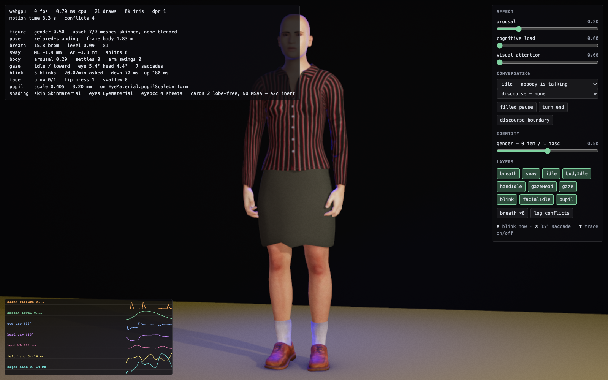
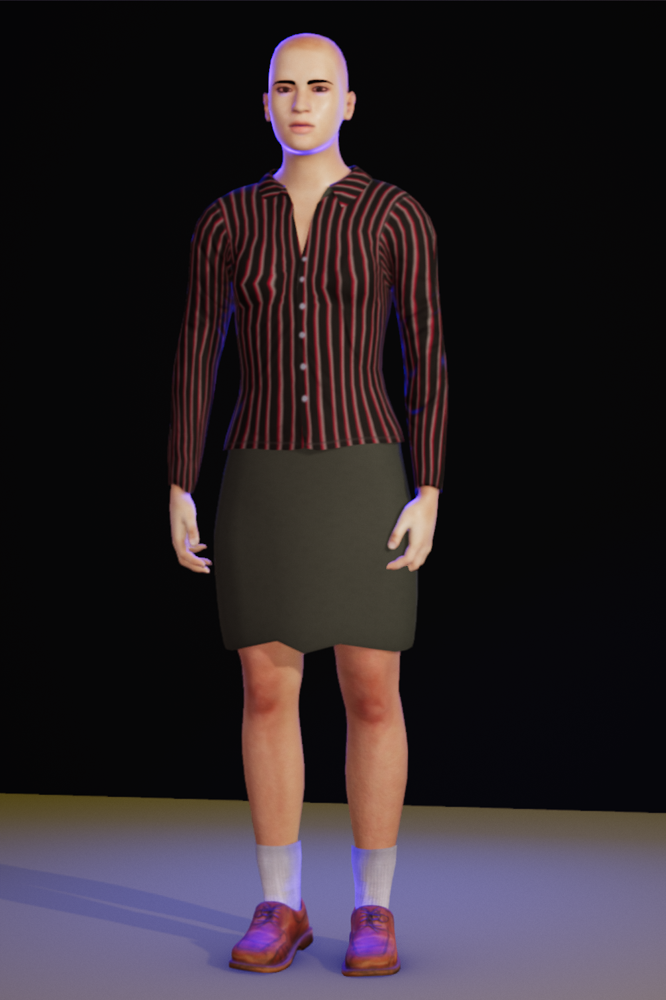
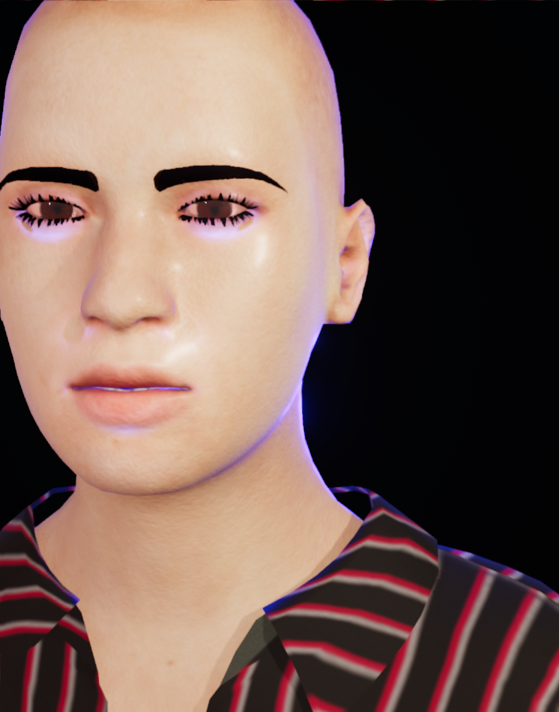

# 姿 Sugata

**A body for an AI.** Real-time WebGPU avatar that feels what it reads and moves its whole body to show it.



## One call

```js
import { Avatar } from './packages/core/src/Avatar.js';

const avatar = await Avatar.create( { canvas: document.getElementById( 'stage' ) } );
```

That is the whole setup. The figure comes back breathing at 15 to 16 breaths a minute, blinking on a
Poisson schedule, running saccades with real main-sequence velocities, and shifting its weight the
way a standing person does.

```js
avatar.feel( 'angry', 0.9 );          // the face and the whole body
await avatar.say( 'I am glad you came back.' );
await avatar.setIdentity( { gender: 0.2 } );
```

## Emotion reaches the body, not just the face

Most avatars emote from the eyebrows up. This one uses all three PAD axes, so anger and fear separate
where a face cannot separate them.

| `feel()` | trunk | arms | dominance |
|---|---:|---:|---:|
| `'angry'` | **+17.99°** forward | −38.32° drawn in | +0.91 |
| `{ pleasure: −0.9, arousal: 0.8, dominance: −0.8 }` | **−3.53°** back | 0° | −0.78 |
| `'happy'` | 0° | **+25.43°** open | +1.00 |

Anger and fear carry identical pleasure and identical arousal. Only dominance tells them apart, and
the trunk goes opposite ways. Those numbers are measured off the rig, not authored.

## Talk to it

Point it at any OpenAI-compatible endpoint and it appraises what you say, feels it, and answers.

```bash
npm run dev
# open http://localhost:5173/src/converse.html with LM Studio running
```

Affect arrives in two tiers. A lexicon and prosody pass runs in under a millisecond so the face moves
before the sentence finishes. An LLM pass follows about a second later and blends in, so the
correction settles instead of popping.

## It is one figure, at any point between

 

`gender` is continuous from 0 to 1. Skin is pre-integrated subsurface scattering with a baked
curvature map, dual-lobe specular and a tiled micro-normal. Eyes are two nested shells with real
corneal refraction. The wardrobe layers, hides the body underneath, and keeps a decency floor in
every reachable state.

## Requirements

- **A browser with WebGPU.** WebGL2 runs at a reduced tier and the API reports which one it chose.
- **Node `^20.19 || >=22.12`** and `git-lfs`. The figure bakes are 232 MB of LFS objects. Clone
  without LFS and you get pointer files, not a body.
- **An OpenAI-compatible LLM endpoint** for the conversation page only. Everything else runs offline.

```bash
git lfs install
git clone https://github.com/tokenfires/sugata-avatar.git
cd sugata-avatar && npm install && npm run dev
```

## Status

The runtime combines skin, eyes, lighting, blink, gaze, breath, sway, affect-driven posture,
gestures, IK and supplied viseme timelines. Wardrobe and detailed identity controls exist in
dedicated modules/testbed pages; they are not yet integrated into the public `Avatar` runtime.
Real TTS and microphone input remain open. `say()` without a supplied timeline does not animate
speech on its own.

The new **portrait study** puts expressions, lighting, camera control and two existing haircuts
on one page. Run `npm run dev`, then open `/src/portrait.html`. The shorter `bob02` cut is available
on the midpoint figure; the original `bob01` covers all five figure bakes. The shorter cut now falls
alongside the cheeks and clears 98 tested motion poses, with its shake preserved. Orbit blackout,
excess area-light skin transmission, and hair GPU resource retention during rebuilds are repaired.
Hair appearance remains unfinished: broad card patches and mottled highlights are still visible.
See the [visual work checkpoint](docs/WORK-SESSION-2026-09-08.md) for matched evidence and limits.

Read [the September 8 restart checkpoint](docs/RESTART-2026-09-08.md) before continuing the hair
research. This clone predates several local experiments preserved separately from the old iCloud
checkout. The older checkpoint must not be treated as the latest experimental recommendation.

`npm run selftests` runs the full gate suite; declared failures live in
[`docs/RED-GATES.md`](docs/RED-GATES.md). The restart checked the affected runtime and browser paths,
not the entire suite, and does not claim a clean full-suite result.

## Documentation

| | |
|---|---|
| [`docs/RESTART-2026-09-08.md`](docs/RESTART-2026-09-08.md) | Current checkout, recovery boundary, portrait verification and next work |
| [`docs/WORK-SESSION-2026-09-08.md`](docs/WORK-SESSION-2026-09-08.md) | Hair correction, renderer repairs, verified results and remaining visual work |
| [`docs/API.md`](docs/API.md) | The full `Avatar` surface, options, and limits |
| [`docs/BRIEF.md`](docs/BRIEF.md) | The original request, verbatim |
| [`docs/PUNCHLIST.md`](docs/PUNCHLIST.md) | Every item and its acceptance gate |
| [`docs/LEARNINGS.md`](docs/LEARNINGS.md) | What went wrong and what it cost |
| [`docs/research/`](docs/research/) | The sourced constants everything is built on |

## Licence

Code is [MIT](LICENSE). The base mesh and its ARKit blendshapes come from MPFB2 and are CC0. No
reference imagery is included in this repository.

Built with [Claude Code](https://claude.com/claude-code).
