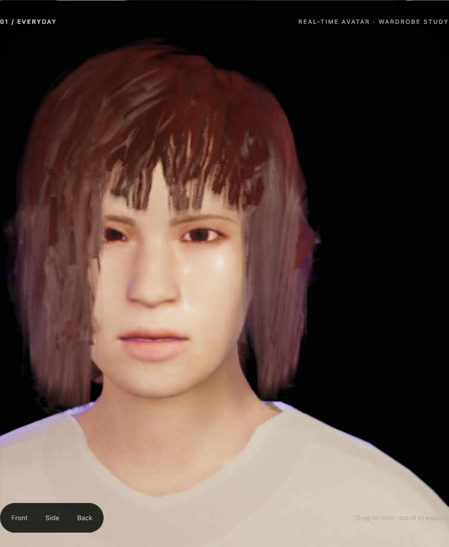

# Casual collar interior — September 16, 2026

This continues Rob's explicit September 16 resumption and bounded parallel work window.
The original [brief](BRIEF.md) remains the target: AAA-quality, humanlike embodiment and
an expressive, configurable wardrobe. This correction closes a localized rendering defect;
it does not accept the collar or avatar as finished art.

## Result and scope

The correction is installed locally in `assets/wardrobe/female_casualsuit01/g050.glb`.
All 18 testbed pages build; the built Showcase passes 24 browser groups with the actual
emitted garment bytes verified. The existing large-chunk build warning remains.

The frozen `casual-collar-v2.glb` geometry is qualified with its own evidence. Its dark
side/back openings were views of culled cloth back faces. A continuous 140-triangle
interior around the neckline makes those faces visible. It leaves all candidate positions,
normals, indices, UVs, skinning, textures and body/foundation masks unchanged.

The runtime reads the interior selection from the garment's GLB metadata, clones its
vertex arrays and material, and draws only the selected back faces. The interior shares
the garment's skeleton and follows its mask, visibility, cache and disposal lifecycle.
It adds 140 rendered triangles and one garment draw call while visible. Textures and
skeleton are borrowed; cloned geometry/material are owned and retired explicitly.
The original outer mesh already casts two-sided shadows, so the interior adds no duplicate
shadow caster. There is no geometric thickness, displacement or rounded seam in this fix.

| Artifact | SHA-256 |
| --- | --- |
| Prior installed trouser fit | `44ebc3eb3a09408a3563d369ae74be15a5bc4beb8040bc43c2c5446d6e65c783` |
| Frozen collar geometry | `ca65319add5a41147df9d894aebe6441a9ab6f5131ee639dd49c3bef74861e5e` |
| Collar geometry plus interior metadata | `d81a6730bde9d8fee4641e18d6f9f0e3922af420bb68eea3f44b661896aeec3a` |

The last two have identical binary geometry payloads; removing the new mesh metadata
makes their JSON identical too. The exact files reproduce from the existing immutable
trouser fixture plus the tracked collar patch. No duplicate large source fixture is required.
The exact previous installed bytes also remain in the ignored archive as
`accepted-before-install.glb`. Sixteen protected asset/calibration/rendering files were
compared with commit `abe85db` before and after installation and remain byte-identical.

The band is selected from the source collar's 20-edge boundary by a 35 mm geodesic seed
distance and complete incident triangles. Those triangles extend as far as 49.56 mm from
the rim. The result is one connected annulus with two 20-edge boundaries, covering all
four original witness triangles. An 11 mm strip missed the witnesses; a 45 mm seed
distance added unnecessary faces. No band expansion was justified by the rendered controls.

## Visual evidence

The [initial diagnosis](RESUME-2026-09-16.md) preserves the ordinary and magenta-foundation
views, pixel-ray localization and material controls. The earlier missing-body explanation
remains refuted: the selected rays also miss the complete restored body.

New evidence is under `captures/collar-window-2026-09-16/`:

| Same frozen geometry, no interior | Same frozen geometry, local interior |
| --- | --- |
|  |  |

These two original PNGs are tracked as well as retained in the full ignored archive.

- `lining-still-v1`: 18 matched candidate/global-two-sided/local-interior images.
- `lining-motion-v2`: 364 PNGs over four 4.5-second natural-motion runs, both bobs,
  candidate versus interior; 40 CPU-skinned geometry snapshots during those GPU runs.
- `owned-views-v1`: the real GLTFLoader/Wardrobe path, with only its asset response replaced
  by the exact metadata candidate. All three colourways have native and elevated views.
  The 12 files labelled `body-*` were cropped by portrait orbit limits and are excluded
  from full-body qualification. This capture-instrument error was fixed in later runs.
- `owned-rear-diagnostic-v1`: 12 matched views plus 450 pixel rays. A small dark rear
  patch prompted a second check: all 20 originally dark witnesses hit triangles 1294/1333,
  already in the band, and the interior matches the global two-sided control exactly at
  those pixels. It is shaded fabric. Pixels above the rim miss all checked geometry and
  remain background. The finite band is not globally pixel-equivalent to two-sided cloth.
- `owned-wardrobe-v1`: 15 correctly framed images, all four foundation combinations,
  elegant/casual changes, cached return and three release/reload cycles. Tracked memory
  counts remain stable between cycles; final retirement is zero with no leaked handles.
- `owned-motion-v1`: 364 matched images through the real metadata loader, with native
  motion at elevated −60° and +60° views. Each of the four runs advances 4.5 seconds.

Each motion run retains all 91 sampled PNGs at 20 images per second plus viewing clips;
the simulation steps at 60 Hz. Tracked renderer memory rises by 217,855–219,815 bytes in
the three held-view colourway comparisons. This is an allocation observation, not a
frame-time benchmark.

The independent critic directly inspected the declared images and selected motion frames;
its reports record exact coverage. The original side wedges close, without a new observed
band-termination defect. The collar still has angular contour segments, a paper-thin edge
and shoulder tonal facets. Accepted hair appearance is preserved, not requalified as AAA.
The [local comparison page](../captures/collar-window-2026-09-16/review.html) offers
colourway/view selection and paired motion clips without altering the original evidence.

Focused checks after installation pass: interior ownership 12 groups, Wardrobe 51 assertions,
AvatarWardrobe 13 groups, colourways 6 groups, collar reproduction 6 groups, foundation
masks 9 groups, preserved trouser fit 7 groups, and Showcase presets 4 groups. The local
comparison page loads its image/video pairs and switches/plays them successfully.
These are selected checks for this change, not a claim that every historical repository
gate is green; the existing red-gate record remains separate.

## Geometry and foundation qualification

The [numerical evidence ledger](evidence/collar-interior-2026-09-16-numerical.json) binds
the independent algorithms, frozen inputs, reports, minimum definitions and negative controls.

- All 180 triangles incident to the 96 moved vertices have positive body and retained-bra
  surface separation in authored and checked native states. Authored minima are 0.551420 mm
  to the full body and 0.532628 mm to the retained bra. The new captured motion states reach
  0.560645 mm to the body and 2.480657 mm to the retained bra.
- The original 1,424 solver samples simultaneously satisfy the tolerated 1.48 mm target.
  A uniform 1.5 mm clearance claim is false: denser supported samples reach 0.661818 mm
  in the authored state. Whole-triangle feature checks, including edge interiors, establish
  the smaller positive distances above.
- The position-welded body is closed and consistently oriented, with exact seams. Winding
  and five-direction ray parity classify the changed patch outside at the checked poses.
  The retained bra is open, so no global bra containment assertion is made.
- All 23,310 frozen authored/historical-pose foundation footprints pass for this exact
  geometry. Omitting the 180 changed triangles fails 3,669 bra and 3,967 vest footprints:
  the earlier trouser-only unchanged-subset argument cannot qualify this collar.
- All four frozen foundation transformations reproduce their accepted files byte-for-byte.
  The exact metadata successor is now explicitly qualified; altered bytes and the unlined
  geometry-only payload remain rejected by the environment gate. Calibration stays frozen.

These are floating-point checks of the changed region at discrete poses. The geometry
snapshots are CPU-skinned data captured during GPU rendering, not GPU vertex readback or
a continuous-time collision certificate. Unchanged garment regions, arbitrary identities,
large gestures and all possible camera paths are outside this qualification.

## Reproduction

Run from the repository root, using fresh output paths:

```sh
node tools/figure-pipeline/casual_collar_fit.mjs --output /tmp/casual-collar-interior.glb
node tools/figure-pipeline/casual_collar_fit.selftest.mjs
node packages/core/src/wardrobe/GarmentInterior.selftest.mjs
node packages/core/src/wardrobe/wardrobe.selftest.mjs
node tools/figure-pipeline/wardrobe_under_masks.selftest.mjs
node tools/figure-pipeline/collar_clearance_review.mjs /tmp/collar-clearance-review
node tools/figure-pipeline/collar_foundation_review.mjs /tmp/collar-foundation-review
node tools/figure-pipeline/collar_motion_review.mjs captures/collar-window-2026-09-16/lining-motion-v2 /tmp/collar-motion-review
```

The numerical reviewers reconstruct the old accepted source from its immutable fixture,
so they survive installed-asset promotion. They also require the preserved ignored pose
archives. `collar_owned_capture.mjs FRESH_DIRECTORY views|rear|motion|wardrobe` runs the
real candidate loader on a local WebGPU browser. Its ignored candidate GLB and historical
capture helpers must remain resident. Each completed capture binds its source hashes and
instrument copy. The earlier `collar_window_capture.mjs` and initial opening probe retain
strict historical source pins; reproduce those on their recorded pre-integration tree.

## Remaining work

Keep this as a recoverable defect correction. The next art step is a separately qualified
rounded neckline/hem construction: first establish a visual target and preserve the current
collar as its control, then measure any added thickness against the small existing clearance.
Do not apply a uniform offset or further body deletion to disguise the thin edge. Broader
motion, garment fit, identity support and the full embodiment brief remain unfinished.

The older recurring automation remains paused and its separate Goal unchanged. This session
used no reset credits, model changes, pushes or publication. Evidence is local, not an
off-machine backup.

The tracked [evidence summary](evidence/collar-interior-2026-09-16.json) and
[archive manifest](evidence/collar-interior-2026-09-16.manifest.json) bind the completed
captures, source snapshots, numerical and independent visual reviews, failed attempts,
test logs and built-app verification. Every archived file was reread and hash-verified.
The branch remains `codex/local-restart`; work ran in the original saved checkout,
preserving all earlier unpushed commits and ignored evidence.
