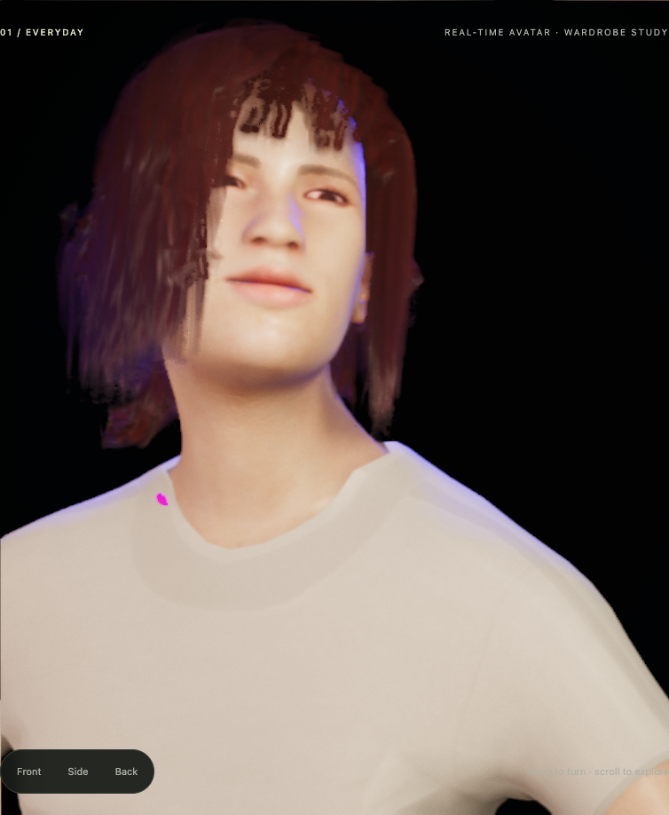

# Sugata — expressive collar checkpoint, September 16, 2026

This is the current restart document. It supersedes the installation status and next-step
priority in [COLLAR-INTERIOR-2026-09-16.md](COLLAR-INTERIOR-2026-09-16.md), while preserving
that document's bounded natural-motion evidence. Rob authorized this resumed session and
its parallel work window. The [full brief](BRIEF.md) remains the target.

## Current state

The original neckline openings are localized and a working interior correction is preserved.
Stronger supported motion then exposed retained-bra intersections and a very small body gap.
**The collar candidate is experimental again; the previous accepted asset is restored as
the default.** Neither version is qualified for unrestricted expressive motion. The restored
asset also fails this new stress test; restoration preserves the accepted baseline rather
than claiming it solves the new problem.

| Asset | SHA-256 | Status |
| --- | --- | --- |
| Previous accepted trouser fit | `44ebc3eb3a09408a3563d369ae74be15a5bc4beb8040bc43c2c5446d6e65c783` | Installed default |
| Frozen September 13 collar | `ca65319add5a41147df9d894aebe6441a9ab6f5131ee639dd49c3bef74861e5e` | Preserved, unpromoted |
| Same collar plus local interior metadata | `d81a6730bde9d8fee4641e18d6f9f0e3922af420bb68eea3f44b661896aeec3a` | Preserved, experimental |

The last two have identical binary geometry. The runtime interior support, exact candidate
generator, ownership tests, colourway compatibility and frozen foundation-coverage evidence
remain in source. The default asset has no interior metadata. Colourway and foundation
environment allowlists establish those specific compatibilities, not general fit acceptance.
No additional geometry, body masks, foundations, hair or shoe fit changed during the stress
diagnosis. The candidate's trouser vertices remain unchanged from the accepted fit.

Work stayed in the original checkout on `codex/local-restart`, starting clean at `6e88b87`,
25 commits ahead of the recorded origin branch. No fetch or push occurred. The unused
detached worktree at `2087931` was untouched. Local commits `abe85db` and `fc88678` preserve
the initial diagnosis and the intermediate interior installation, respectively. The latter
is a recoverable experiment, not the final default state.

## Two distinct causes

The original dark side/back openings are **culled cloth back faces**. The selected rays miss
even the complete restored body; the earlier body-mask explanation remains refuted. A
140-face local interior closes those openings without changing the frozen candidate's
positions, normals, skinning, UVs, masks or material appearance recipe. Its earlier natural
motion, oblique-view, wardrobe-lifecycle and foundation-coverage checks remain valid in their
declared scope. See the [interior checkpoint](COLLAR-INTERIOR-2026-09-16.md) for that evidence.

The new small gray island during a happy shoulder gesture is **the retained bra in front
of the cloth**. These are original, uncropped images from the exact 1.65-second frame:

| Ordinary candidate | Only the bra changed to magenta |
| --- | --- |
|  |  |

The ordinary control reproduces the motion PNG byte-for-byte. All three control runs match
the saved rig, morphs, physical hair state, affect/gesture telemetry and renderer clock.
Among 598 pixel-centre rays, 110 magenta-tag witnesses first hit the retained bra, including
when the whole cloth is picked two-sided or the complete body is restored for picking.
Those same 110 ordinary RGB values are unchanged by the rendered global two-sided control.
The cloth behind them is on faces 1328/1331. At pixel (181.5, 563.5), the ordering is bra
16148, cloth 1328, then body 2400. This cannot be closed by extending the interior band.

The CPU picker excludes GPU hair and the owned interior child. The global two-sided pass
accounts for the outer cloth's back faces; the actual GPU colour control supplies direct
visible-surface attribution. Ray depth differences are view-dependent, not penetration depth.
An initial witness replay failed on signed zero versus serialized JSON. The successful
replay explicitly uses the same JSON number semantics on both sides, with no numeric tolerance;
PNG byte identity independently confirms the reproduced frame. Failed evidence is retained.

## Motion and numerical evidence

The stress uses supported `Avatar.feel` and `say` calls, the native motion layers and clamps,
seed 20260807, and synthetic gesture timing with no audio or external model. Four real GPU
runs compare previous versus experimental assets with bob01 and bob02. Each advances
18 seconds at 60 Hz through happy, angry and fearful phases, with two timed bilateral
gestures per phase. They retain **1,444 main PNGs**, 12 full-body views, four viewing clips,
and 76 CPU-skinned snapshots (19 per run). Clips sample at 20 Hz; they do not replace the
original images. Matched arms have exact physical/rig/telemetry/renderer state. All runs
retire to zero tracked resources with no errors or leaked handles.

| Experimental candidate pose | Whole-patch body minimum | Retained bra |
| --- | ---: | --- |
| Happy idle, 0.6 s | 0.548208 mm | 0.565610 mm minimum |
| First happy stroke, step 98 / 1.633333 s | 0.568380 mm | Crosses faces 1327, 1328, 1329, 1331 |
| Retracted, 2.6 s | 0.337790 mm | 0.530531 mm minimum |
| Second happy stroke, step 270 / 4.5 s | 0.568772 mm | Crosses faces 544, 545, 1328, 1329, 1331 |
| Final angry pose, step 720 / 12 s | **0.0468534 mm** | 2.590919 mm minimum |

Both bobs reproduce the geometric failures. At step 720, the next affect command has been
issued but no further simulation step has run; geometry still reflects the final angry pose.
The smallest body pair is garment 1515 / body 15580, edge-to-edge. All 38 candidate samples
have zero body crossings, inside winding classifications or inside/ambiguous parity results
on the 180-face changed patch. The position-welded body is closed, consistently oriented,
and has exact sampled seams. The open bra sheet supports separation/intersection checks,
not a global signed-containment claim. All 2,281 unchanged garment vertices coincide across
the 38 paired source/candidate states. Independent kernel controls and archive integrity pass.
The 38 candidate samples contain 19 distinct geometries; reuse between bobs required exact
geometry-hash equality. Global body self-intersection was not audited. Closed topology and
winding/parity checks are not an interval-arithmetic certificate.

These are floating-point, discrete-pose checks of the changed region. The snapshots are
CPU-skinned during GPU rendering, not GPU vertex readback or a continuous-time certificate.
The minimum body margin is too small to treat as a robust all-motion fit. Intersection-pair
counts depend on tessellation and do not measure visible area or severity.

The independent visual review also records hands entering the trousers at the angry pose
in both control and candidate. That is a pre-existing broader embodiment problem, not an
excuse to alter the accepted trouser fit here. The collar remains thin/angular, and the
full AAA-quality, humanlike embodiment remains unfinished.
The [independent verdict](../captures/collar-expression-stress-2026-09-16/visual-review/FINAL-VERDICT.md)
holds promotion. Direct viewing covered 59 files: 44 selected close frames, all 12 full-body
stills and the three witness controls. Its complete frame list distinguishes direct visual
inspection from the larger hash/state audit; no exhaustive motion-viewing claim is made.

## Next bounded experiment

The frozen solver constrained the full body at authored and mild native poses. **It never
included the retained bra as an obstacle.** A left-side-only correction was considered and
rejected after the second happy stroke exposed the opposite side and the rear margin.

The preserved [fit plan](../captures/collar-expression-stress-2026-09-16/fit-plan/PLAN.md) proposes
one cloth-only trial, capped at 3 mm additional displacement, jointly constrained by both
contact regions and all 19 captured poses. Its proposed contact support is 34 welded groups /
43 raw vertices, incident to 91 faces; 10 faces extend outside the existing interior band.
A disjoint one-ring rear guard around face 1515 stays fixed. This is a proposal, not an
executed solve or a claim that 3 mm will suffice.

Keep topology, indices, UVs, weights, masks, foundations, accepted hair and lower garments
fixed. Recheck every incident triangle, original and new poses, shape guards, exact frozen
foundation coverage, actual GPU motion, both oblique sides, band boundaries, styles and
wardrobe lifecycle. The new candidate needs its own hash and evidence. Stop after one
candidate if constraints conflict or those checks fail; retain the failure and refine the
model before trying again. Rounded-edge art work follows adequate fit, not vice versa.

## Reproduction and recovery

The [local review page](../captures/collar-expression-stress-2026-09-16/review.html) presents
paired clips and the three exact-frame controls. The [numerical ledger](evidence/collar-expression-stress-2026-09-16-numerical.json)
binds the algorithms, snapshots, reports and limits. The [session evidence summary](evidence/collar-expression-stress-2026-09-16.json)
and [archive manifest](evidence/collar-expression-stress-2026-09-16.manifest.json) bind the rest.
Raw evidence stays under the ignored `captures/` directories; do not delete it.

```sh
node tools/figure-pipeline/collar_stress_capture.mjs /tmp/collar-stress-replay
node tools/figure-pipeline/collar_stress_review.mjs captures/collar-expression-stress-2026-09-16/gpu-v1 captures/collar-expression-stress-2026-09-16/cpu-replay
node tools/figure-pipeline/collar_stress_witness.mjs /tmp/collar-stress-witness
node tools/figure-pipeline/casual_collar_fit.mjs --output /tmp/casual-collar-interior.glb
```

Use fresh output directories. Capture/witness tools route the exact archived candidate
through the real loader without changing the default. They need the preserved local GLBs
and historical capture helpers; the generator also reconstructs the candidate from tracked
source/recipe. The original completed captures retain their exact instruments; later replay
plumbing is identified separately. Pixel analysis takes a witness directory beside `gpu-v1`
and a fresh output directory. The full 18-second sequence has not been rerun after the
replay-only routing change. The route replay reproduces all three exact-frame PNGs and
states byte-for-byte with the old default installed, and again passes the 110-pixel analysis.

After restoring the default, all 18 pages build and the built Showcase passes 24 browser
groups with the actual emitted asset hash verified. Focused checks pass: interior ownership
12 groups, Wardrobe 51 assertions, candidate reproduction 6 groups, foundation masks 9 groups,
and preserved trouser fit 7 groups. The comparison page loads all original images and four
clips; paired play/pause/restart, playback speed and a 390-pixel layout pass. The existing
large-chunk build warning remains. These selected checks do not replace the repository's
older, separately recorded red gates or establish whole-avatar visual acceptance.

All 1,193 files in the earlier interior archive were rehashed unchanged. Sixteen protected
asset/calibration/rendering files also match their earlier hashes after restoration.

The older recurring automation remains paused and its separate Goal unchanged. No reset
credits, model changes, push or publication were used. These are local checkpoints and
evidence, not an off-machine backup.
